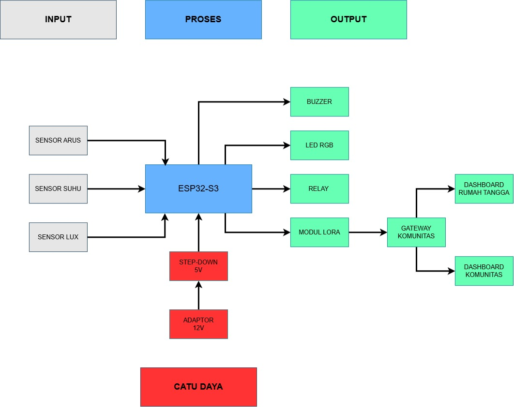
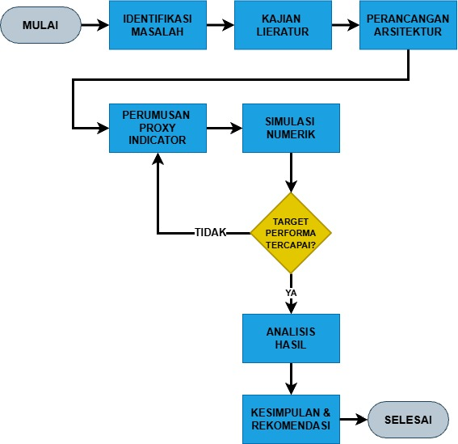
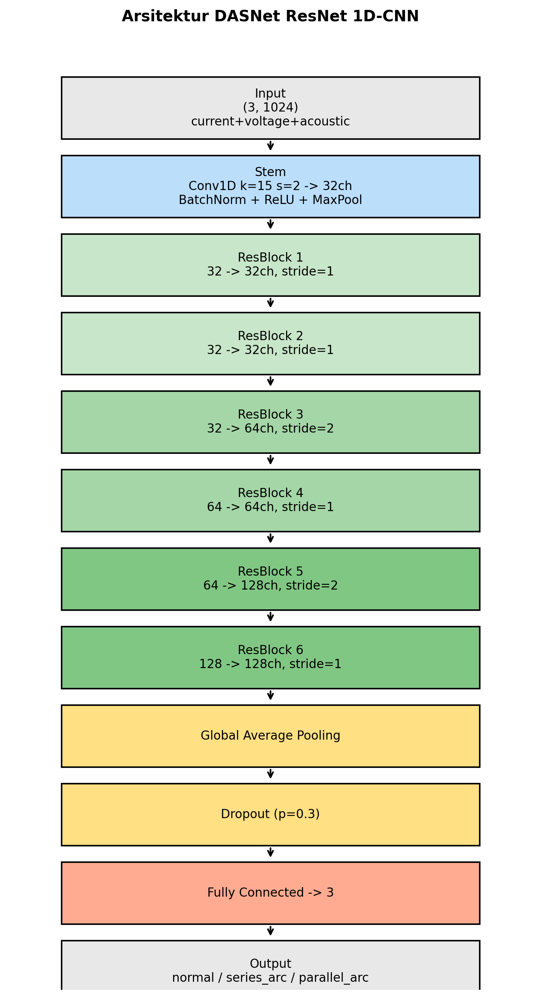
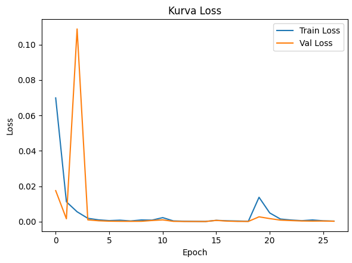
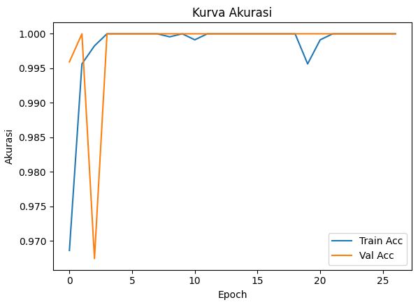
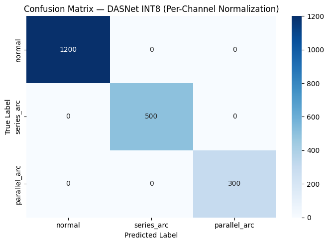
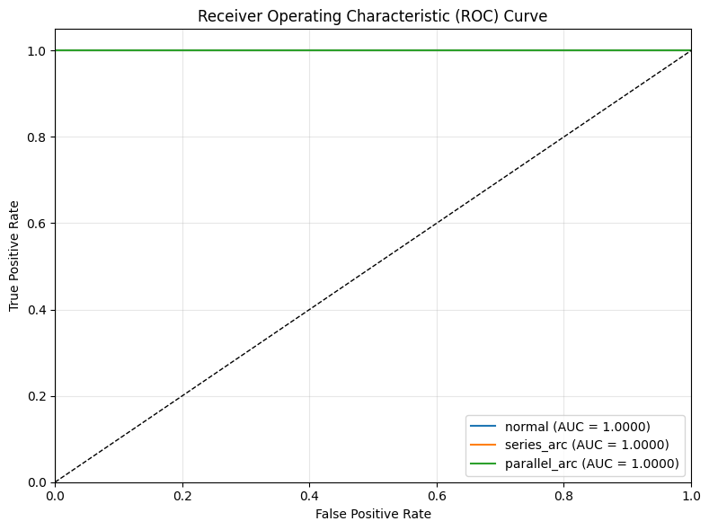
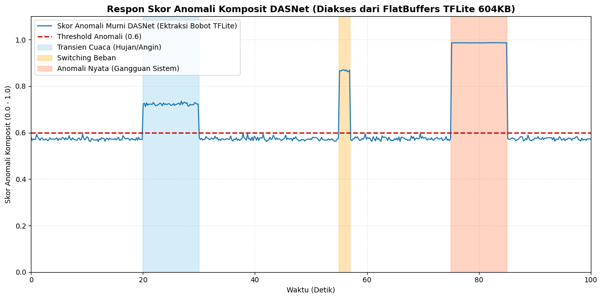

<div align="center">

# DASNet

### **Kerangka Deteksi Dini Arc Fault DC Berbiaya Rendah pada PLTS Atap Berbasis Fusi Proxy Indikator dan Edge-AI Terdistribusi Antar-Rumah**

**Tim Xtal — Institut Teknologi Sumatera**

<br>


</div>

---

> [!IMPORTANT]
> Repositori ini mendokumentasikan **studi kelayakan konsep (proof-of-concept)** DASNet berbasis kajian literatur, dataset sekunder/sintetis, simulasi numerik, serta pipeline TinyML. Hasil performa yang ditampilkan **bukan hasil pengujian purwarupa fisik pada PLTS riil** dan tidak boleh diperlakukan sebagai pengganti perangkat AFCI tersertifikasi.

## Daftar Isi

- [Tentang DASNet](#tentang-dasnet)
- [Tim Xtal](#tim-xtal)
- [Permasalahan yang Diangkat](#permasalahan-yang-diangkat)
- [Tujuan dan Target Perancangan](#tujuan-dan-target-perancangan)
- [Konsep Utama](#konsep-utama)
- [Arsitektur Sistem](#arsitektur-sistem)
- [Flowchart Sistem](#flowchart-sistem)
- [Fusi Proxy Indicator](#fusi-proxy-indicator)
- [Dataset dan Pra-pemrosesan](#dataset-dan-pra-pemrosesan)
- [Arsitektur ResNet 1D-CNN](#arsitektur-resnet-1d-cnn)
- [Pelatihan dan Kuantisasi](#pelatihan-dan-kuantisasi)
- [Hasil Evaluasi](#hasil-evaluasi)
- [Ketahanan terhadap Variabilitas Lingkungan](#ketahanan-terhadap-variabilitas-lingkungan)
- [Jaringan Terdistribusi Antar-Rumah](#jaringan-terdistribusi-antar-rumah)
- [Bill of Materials](#bill-of-materials)
- [Firmware ESP32-S3](#firmware-esp32-s3)
- [Struktur Repositori](#struktur-repositori)
- [Cara Menggunakan Repositori](#cara-menggunakan-repositori)
- [Batasan Penelitian](#batasan-penelitian)
- [Pengembangan Lanjutan](#pengembangan-lanjutan)
- [Referensi Utama](#referensi-utama)

---

## Tentang DASNet

**DASNet (Distributed Arc-Signature Network)** adalah kerangka deteksi dini **DC arc fault** untuk instalasi **PLTS atap rumah tangga** yang dirancang dengan pendekatan berbiaya rendah, pemrosesan **Edge-AI**, serta komunikasi terdistribusi antar-rumah.

DASNet menggabungkan dua jalur validasi yang saling melengkapi:

1. **Validasi arsitektural** melalui fusi tiga *proxy indicator*:
   - riak arus,
   - laju kenaikan suhu sambungan,
   - deviasi efisiensi daya berbasis iradiansi.

2. **Validasi pipeline TinyML** melalui model **ResNet 1D-CNN** yang dikuantisasi untuk eksekusi pada mikrokontroler kelas rendah, khususnya **ESP32-S3**.

Node DASNet bekerja secara **on-device**, memberikan peringatan lokal, dapat mengeksekusi proteksi melalui relai, serta mengirimkan status anomali ke **gateway komunitas** menggunakan **LoRa SX1278 433 MHz**.

---

## Tim Xtal

| Nama | Peran dalam Karya | Institusi |
|---|---|---|
| **Nazuwatussya'diyah** | Dosen Pembimbing | Institut Teknologi Sumatera |
| **Rafi Rafsanjani** | Ketua Tim / Peneliti | Institut Teknologi Sumatera |
| **Muhammad Yusuf Aditiya** | Anggota Tim / Peneliti | Institut Teknologi Sumatera |
| **Dimas Rifai** | Anggota Tim / Peneliti | Institut Teknologi Sumatera |

**Nama Tim:** `Xtal`

---

## Permasalahan yang Diangkat

Gangguan **arc fault DC** pada instalasi fotovoltaik dapat dipicu oleh degradasi konektor MC4, kesalahan *crimping*, sambungan longgar, maupun penuaan isolasi kabel. Karena arus DC tidak memiliki titik nol seperti AC, busur listrik dapat terus bertahan dan tidak selalu memicu MCB konvensional.

Di sisi lain, solusi **Arc Fault Circuit Interrupter (AFCI)** komersial dinilai relatif mahal untuk pengguna PLTS rumah tangga skala kecil. DASNet dirancang untuk mengeksplorasi pendekatan alternatif yang:

- dapat berjalan pada mikrokontroler murah,
- tidak bergantung pada ADC berkecepatan sangat tinggi,
- meminimalkan *false-positive*,
- bekerja secara lokal tanpa ketergantungan cloud,
- dapat berkolaborasi sebagai jaringan deteksi tingkat komunitas.

---

## Tujuan dan Target Perancangan

Target awal penelitian DASNet adalah:

| Parameter | Target |
|---|---:|
| Akurasi klasifikasi | **≥ 90%** |
| Latensi pelaporan | **< 500 ms** |
| False-positive rate | **< 5%** |
| Estimasi BOM per node | **< Rp320.000** |
| Platform edge | **ESP32-S3** |
| Komunikasi | **LoRa SX1278 433 MHz** |
| Eksekusi AI | **On-device / TinyML** |

---

## Konsep Utama

```text
PLTS Atap
   │
   ├── Sensor Arus ───────────► Riak Arus
   ├── Sensor Suhu ───────────► Laju Kenaikan Suhu
   └── Sensor Iradiansi ──────► Deviasi Efisiensi
                                  │
                                  ▼
                         Fusi Proxy Indicator
                                  │
                 ┌────────────────┼────────────────┐
                 ▼                ▼                ▼
              NORMAL           WASPADA           BAHAYA
                 │                │                │
                 └──── LED / Buzzer / Relay ─────┘
                                  │
                                  ▼
                         LoRa SX1278 433 MHz
                                  │
                                  ▼
                         Gateway Komunitas
                                  │
                    ┌─────────────┴─────────────┐
                    ▼                           ▼
              Dashboard Rumah            Dashboard Komunitas
```

---

## Arsitektur Sistem

Blok diagram DASNet menerapkan skema **Input – Process – Output** dengan catu daya independen.



### Input

| Sensor | Fungsi |
|---|---|
| **ACS712** | Menangkap karakteristik arus dan riak arus abnormal pada jalur DC |
| **DS18B20** | Mengukur suhu sambungan dan gradien kenaikan suhu |
| **BH1750** | Mengukur iluminansi sebagai proksi iradiansi untuk koreksi efisiensi |

### Process

Pemrosesan utama dilakukan oleh **ESP32-S3** untuk:

- akuisisi data sensor,
- pemfilteran data,
- normalisasi,
- kalkulasi *proxy indicator*,
- fusi skor anomali,
- inferensi TinyML,
- klasifikasi status,
- proteksi lokal,
- komunikasi LoRa.

### Output

| Komponen | Fungsi |
|---|---|
| LED RGB | Indikator visual status Normal / Waspada / Bahaya |
| Buzzer | Alarm lokal |
| Relai | Aktuator pemutusan jalur DC pada kondisi bahaya |
| LoRa SX1278 | Transmisi status ke gateway komunitas |
| Dashboard | Pemantauan individual dan agregat komunitas |

---

## Flowchart Sistem



Alur penelitian dan implementasi secara umum mencakup:

1. Identifikasi masalah.
2. Kajian literatur dan *research gap*.
3. Perancangan arsitektur.
4. Pemilihan komponen.
5. Perumusan fusi *proxy indicator*.
6. Pra-pemrosesan dataset.
7. Pelatihan ResNet 1D-CNN.
8. Kuantisasi model.
9. Konversi model menjadi header C++.
10. Deployment pada ESP32-S3.
11. Simulasi komunikasi LoRa.
12. Evaluasi performa.

---

## Fusi Proxy Indicator

DASNet menghindari ketergantungan penuh pada analisis spektrum frekuensi tinggi dengan mengubah kondisi fisik sistem menjadi tiga indikator anomali.

### 1. Indikator Riak Arus

Indikator riak dihitung sebagai deviasi standar arus yang dinormalisasi terhadap rerata bergerak dalam jendela waktu satu detik:

```math
I_{ripple} = \frac{\sigma(I_{t-N:t})}{\overline{I}_{t-N:t}}
```

### 2. Indikator Laju Suhu

Laju kenaikan suhu sambungan:

```math
T_{rate} = \frac{dT}{dt}
```

### 3. Indikator Deviasi Efisiensi

```math
\eta_{dev}
=
1 -
\frac{P_{out,actual}}
{k \cdot G_{irradiance} \cdot A_{panel}}
```

dengan:

- `k` = konstanta efisiensi panel dari kalibrasi,
- `G` = iradiansi terukur dalam W/m²,
- `A` = luas efektif panel.

### 4. Skor Anomali Komposit

```math
S_{anomali}
=
w_1 I_{ripple}
+
w_2 T_{rate}
+
w_3 \eta_{dev}
```

Bobot `w1`, `w2`, dan `w3` ditentukan melalui optimasi **grid search** pada tahap pelatihan luring.

### Klasifikasi Status

| Skor | Status | Respons |
|---:|---|---|
| `S < 0,3` | 🟢 **Normal** | Monitoring |
| `0,3 ≤ S < 0,7` | 🟡 **Waspada** | Peringatan lokal |
| `S ≥ 0,7` | 🔴 **Bahaya** | Alarm dan lapisan proteksi |

> **Catatan:** nilai numerik bobot `w1`, `w2`, dan `w3` tidak dicantumkan pada naskah LKTI. Firmware menyediakan parameter yang harus disesuaikan dengan hasil *grid search* final.

---

## Dataset dan Pra-pemrosesan

Pipeline TinyML menggunakan dataset sekunder/sintetis multi-sensor dengan tiga kanal:

| Berkas | Kanal | Ukuran |
|---|---|---:|
| `sensor1_current.csv` | Sinyal arus DC | ~69,1 MB |
| `sensor2_voltage.csv` | Fluktuasi tegangan DC | ~78,2 MB |
| `sensor3_acoustic_em.csv` | Emisi akustik-elektromagnetik | ~73,3 MB |
| `labels.csv` | Label kelas | ~154 KB |

Dataset mentah terdiri dari sekitar **30.000 baris**, kemudian melalui:

```text
Raw multi-sensor data
        │
        ▼
Interpolasi linear
        │
        ▼
Segmentasi time-series
        │
        ▼
13.333 sampel × 3 kanal × 1024 titik
        │
        ▼
Stratified split 70 : 15 : 15
        │
        ├── Training
        ├── Validation
        └── Testing = 2.000 sampel
        │
        ▼
Z-score normalization
(parameter hanya dari training set)
        │
        ▼
Class-weighted loss
```

### Distribusi Kelas

| Kelas | Jumlah Sampel |
|---|---:|
| `normal` | 8.000 |
| `series_arc` | 3.333 |
| `parallel_arc` | 2.000 |
| **Total** | **13.333** |

`series_arc` dan `parallel_arc` sama-sama diposisikan sebagai kondisi berisiko tinggi dalam konteks proteksi karena keduanya berpotensi berkembang menjadi kondisi kebakaran.

---

## Arsitektur ResNet 1D-CNN



Input model memiliki bentuk:

```text
(3, 1024)
```

dengan tiga kanal sinyal per sampel.

Arsitektur utama:

```text
Input
  │
  ▼
Conv1D
  │
Batch Normalization
  │
ReLU
  │
MaxPool
  │
  ▼
Residual Block — 32 channels
  │
  ▼
Residual Block — 64 channels
  │
  ▼
Residual Block — 128 channels
  │
  ▼
Global Average Pooling
  │
Dropout
  │
Fully Connected Layer
  │
  ▼
3 Classes
 ├── normal
 ├── series_arc
 └── parallel_arc
```

Koneksi residual digunakan untuk mempertahankan aliran gradien selama ekstraksi fitur time-series multi-kanal.

---

## Pelatihan dan Kuantisasi

Model dilatih selama **27 epoch** hingga mencapai konvergensi dengan *validation loss* mendekati nol.

### Kurva Loss



### Kurva Akurasi



Setelah pelatihan, model dikonversi ke format TensorFlow Lite dan dikuantisasi agar lebih sesuai untuk perangkat edge.

| Model | Presisi | Ukuran File Repository | Keterangan |
|---|---|---:|---|
| `dasnet_float32.tflite` | FP32 | ~2,1 MB | Model TensorFlow Lite sebelum kuantisasi lebih lanjut |
| `dasnet_float16.tflite` | FP16 | ~1,1 MB | Model dengan reduksi presisi Float16 |
| `dasnet_model_data.h` | Header C++ | ~3,6 MB | Representasi model untuk penyematan firmware |
| Model inferensi INT8 pada evaluasi | INT8 | ~604 KB | Ukuran model inferensi yang dilaporkan dalam studi |

---

# Hasil Evaluasi

## 1. Confusion Matrix



Evaluasi pada **2.000 sampel test set independen** menghasilkan klasifikasi sempurna pada dataset evaluasi yang digunakan:

| Kelas | Sampel Test | Precision | Recall | F1-score | AUC |
|---|---:|---:|---:|---:|---:|
| Normal | 1.200 | 1,00 | 1,00 | 1,00 | 1,00 |
| Series Arc | 500 | 1,00 | 1,00 | 1,00 | 1,00 |
| Parallel Arc | 300 | 1,00 | 1,00 | 1,00 | 1,00 |
| **Total / Macro** | **2.000** | **1,00** | **1,00** | **1,00** | **1,00** |

**Akurasi test set: `100%`**

> [!CAUTION]
> Akurasi 100% diposisikan dalam naskah sebagai **ideal baseline / batas atas teoritis** karena dataset sekunder/sintetis memiliki karakteristik yang lebih terkontrol daripada kondisi lapangan. Noise inverter nonlinear, variasi cuaca ekstrem, sensor drift, dan karakteristik perangkat nyata dapat menurunkan performa operasional.

---

## 2. ROC Curve



Pada dataset evaluasi, nilai **AUC = 1,00** untuk ketiga kelas target.

---

## 3. Perbandingan dengan Metode Eksisting

| Metode | Komputasi / Ukuran | Sampling / Latensi | Akurasi |
|---|---|---|---:|
| FFT + ANN — Anggriawan et al. (2023) | Tinggi / >5 MB | 100 kHz / ~1.200 ms | 99,98% |
| Ensemble ML — Le et al. (2020) | Sedang / ~12 MB | 20 kHz / ~850 ms | 98,2% |
| Conv1D — Dang et al. (2021) | Sangat tinggi / ~25 MB | 1 MHz / ~500 ms | 99,1% |
| **DASNet INT8** | **Sangat rendah / ~604 KB** | **<1 kHz / <350 ms** | **100% (simulasi)** |

Fokus DASNet bukan sekadar mengejar akurasi maksimum, tetapi mengeksplorasi *trade-off* antara:

- performa,
- kebutuhan komputasi,
- sampling rate,
- biaya perangkat,
- latensi,
- kemampuan deployment pada mikrokontroler.

---

## Ketahanan terhadap Variabilitas Lingkungan



Simulasi terhadap kondisi transien cuaca dan *switching* beban menunjukkan bahwa indikator tunggal berbasis riak arus lebih mudah menghasilkan alarm palsu.

| Skema Deteksi | False-positive Rate | Akurasi Komposit |
|---|---:|---:|
| Indikator riak arus tunggal | 18,5% | — |
| **Fusi tiga proxy indicator** | **4,3%** | **91,2%** |

Reduksi FPR menjadi **4,3%** penting untuk menekan risiko **nuisance tripping**.

---

## Jaringan Terdistribusi Antar-Rumah

DASNet tidak hanya dirancang sebagai perangkat *standalone*. Setiap node edge dapat menjadi bagian dari jaringan komunitas.

### Topologi Simulasi

```text
 Rumah 01 ─┐
 Rumah 02 ─┤
 Rumah 03 ─┤
    ...    ├──► LoRa 433 MHz ───► Gateway Komunitas ───► Dashboard
 Rumah 20 ─┘
```

### Hasil Simulasi Jaringan

| Parameter | Hasil |
|---|---:|
| Jumlah node | **20 node** |
| Gateway | **1 gateway komunitas** |
| Frekuensi | **433 MHz** |
| Rata-rata latensi end-to-end | **340 ms** |
| Target maksimum | **500 ms** |
| PDR LoRa | **>98,6%** |
| Gangguan simultan yang diuji | **hingga 5 node** |

Arsitektur ini memungkinkan gateway membedakan gangguan lokal pada satu rumah dari pola anomali yang muncul serentak pada beberapa instalasi di kawasan yang sama.

---

## Bill of Materials

Estimasi biaya perangkat elektronik untuk satu node edge:

| Komponen | Spesifikasi | Estimasi Biaya |
|---|---|---:|
| Mikrokontroler utama | ESP32-S3 N8R8 | Rp120.000 |
| Transceiver komunikasi | LoRa SX1278 433 MHz | Rp85.000 |
| Sensor proxy proteksi | ACS712 + DS18B20 + BH1750 | Rp55.000 |
| Proteksi | Modul relai optocoupler 5V / Songle 5V | Rp6.000 |
| Alarm & indikator | Active buzzer + LED RGB | Rp12.000 |
| Catu daya & step-down | Power Supply 12V/2A + LM2596 | Rp35.000 |
| **Total BOM per node** |  | **Rp313.000** |

Dalam studi, AFCI komersial bersertifikasi UL 1699B dibandingkan pada rentang sekitar **Rp2,5–5 juta**, sehingga estimasi biaya DASNet merepresentasikan potensi penghematan sekitar **87–94%** pada tahap konsep.

> Estimasi BOM belum mencakup casing, integrasi mekanik, biaya manufaktur, sertifikasi, pengujian keselamatan, dan instalasi lapangan.

---

## Firmware ESP32-S3

Firmware utama tersedia pada:

```text
main.cpp
```

Implementasi mencakup:

- ESP-IDF + FreeRTOS,
- sampling ACS712,
- pembacaan DS18B20,
- BH1750 melalui I²C,
- filter firmware,
- kalkulasi *proxy indicator*,
- klasifikasi Normal / Waspada / Bahaya,
- LED RGB,
- buzzer,
- relay,
- driver LoRa SX1278,
- telemetri ke gateway,
- loader TensorFlow Lite Micro,
- inferensi model terkuantisasi,
- pengukuran latensi inferensi.

### Model Header

Firmware menggunakan:

```cpp
#include "dasnet_model_data.h"
```

Header tersebut merupakan representasi model yang disematkan ke firmware ESP32-S3.

### Catatan Penting Domain Input

Model ResNet 1D-CNN pada jalur validasi TinyML dilatih pada:

```text
current + voltage + acoustic_em
```

sedangkan arsitektur sensor target DASNet menggunakan:

```text
current + temperature + irradiance
```

Karena kedua domain kanal tersebut **tidak identik**, implementasi firmware sebaiknya tidak menganggap inferensi dari model sekunder sebagai pengganti validasi model pada sensor fisik target. Pada `main.cpp`, skema fusi proxy tetap menjadi dasar keputusan live sampai pipeline model dilatih/ditransfer menggunakan data sensor target yang representatif.

---

## Struktur Repositori

```text
DASNet/
│
├── README.md
├── main.cpp
├── dasnet_model_data.h
│
├── DASNet_ResNet1D_CNN.ipynb
├── dasnet_float32.tflite
├── dasnet_float16.tflite
│
├── sensor1_current.csv
├── sensor2_voltage.csv
├── sensor3_acoustic_em.csv
├── labels.csv
│
├── blok_diagram_arsitektur_dasnet.jpg
├── flowchart_sistem_dasnet.png
├── confusion_matrix_dasnet.png
├── arsitektur_resnet1D.png
├── grafik_respon_anomali_dasnet.png
├── kurva_akurasi_dasnet.png
├── kurva_loss_dasnet.png
└── kurva_roc_dasnet.png
```

### Deskripsi Berkas

| Berkas | Format | Ukuran ± | Fungsi |
|---|---|---:|---|
| `README.md` | Markdown | — | Dokumentasi repositori |
| `main.cpp` | C++ | — | Firmware ESP-IDF/FreeRTOS |
| `dasnet_model_data.h` | Header C++ | ~3,6 MB | Model untuk deployment firmware |
| `DASNet_ResNet1D_CNN.ipynb` | Notebook | ~1 MB | Pipeline preprocessing, training, evaluasi dan kuantisasi |
| `dasnet_float32.tflite` | TFLite | ~2,1 MB | Model FP32 |
| `dasnet_float16.tflite` | TFLite | ~1,1 MB | Model FP16 |
| `sensor1_current.csv` | CSV | ~69,1 MB | Data sinyal arus |
| `sensor2_voltage.csv` | CSV | ~78,2 MB | Data sinyal tegangan |
| `sensor3_acoustic_em.csv` | CSV | ~73,3 MB | Data emisi akustik-elektromagnetik |
| `labels.csv` | CSV | ~154 KB | Label kelas |

| `blok_diagram_arsitektur_dasnet.jpg` | JPG | ~39 KB | Diagram arsitektur |
| `flowchart_sistem_dasnet.png` | PNG | ~58 KB | Flowchart sistem |
| `confusion_matrix_dasnet.png` | PNG | ~29 KB | Confusion matrix |
| `arsitektur_resnet1D.png` | PNG | ~181 KB | Arsitektur Resnet 1D |
| `grafik_respon_anomali_dasnet.png` | PNG | ~90 KB | Respons skor anomali |
| `kurva_akurasi_dasnet.png` | PNG | ~26 KB | Kurva akurasi |
| `kurva_loss_dasnet.png` | PNG | ~25 KB | Kurva loss |
| `kurva_roc_dasnet.png` | PNG | ~42 KB | Kurva ROC |

---

## Cara Menggunakan Repositori

### 1. Eksplorasi Pipeline Machine Learning

Buka:

```text
DASNet_ResNet1D_CNN.ipynb
```

Notebook menjadi titik utama untuk:

- membaca dataset,
- interpolasi,
- segmentasi,
- normalisasi,
- pembagian data,
- training ResNet 1D-CNN,
- evaluasi,
- visualisasi,
- konversi model.

### 2. Model TensorFlow Lite

Model yang tersedia:

```text
dasnet_float32.tflite
dasnet_float16.tflite
```

Untuk deployment ESP32-S3, model yang telah dikonversi ke array C/C++ digunakan melalui:

```text
dasnet_model_data.h
```

### 3. Firmware ESP-IDF

Letakkan minimal:

```text
main.cpp
dasnet_model_data.h
```

pada komponen aplikasi ESP-IDF yang telah dikonfigurasi dengan TensorFlow Lite Micro.

Contoh struktur proyek:

```text
dasnet-firmware/
├── CMakeLists.txt
├── sdkconfig
└── main/
    ├── CMakeLists.txt
    ├── main.cpp
    └── dasnet_model_data.h
```

Lalu gunakan alur standar ESP-IDF:

```bash
idf.py set-target esp32s3
idf.py build
idf.py flash monitor
```

> Konfigurasi pin, parameter kalibrasi sensor, bobot fusi, tensor arena, dan integrasi komponen TensorFlow Lite Micro harus disesuaikan dengan board serta environment pengembangan yang digunakan.

---

## Status Klasifikasi

| Status | Makna | Indikasi |
|---|---|---|
| 🟢 **Normal** | Tidak terdapat anomali signifikan | Operasi normal |
| 🟡 **Waspada** | Anomali awal / perlu observasi | Alarm awal |
| 🔴 **Bahaya** | Indikasi kuat gangguan | Proteksi lokal / eskalasi |

---

## Mitigasi Risiko

| Risiko | Mitigasi yang Diusulkan |
|---|---|
| Interferensi LoRa | Proteksi lokal tidak bergantung pada konfirmasi gateway |
| Sensor drift / noise | Moving-average / smoothing pada firmware |
| Overfitting dataset sintetis | Validasi HIL dan data lapangan |
| Data leakage | Statistik normalisasi dihitung dari training set |
| Ketidakseimbangan kelas | Class-weighted loss |
| Gangguan komunikasi | Failsafe FreeRTOS pada node |
| Keamanan transmisi | Pengembangan lanjutan dengan AES-128 |

---

## Batasan Penelitian

Penelitian ini berada pada tahap **studi kelayakan konseptual**.

Beberapa batasan penting:

- belum merupakan validasi purwarupa fisik pada PLTS atap riil,
- pipeline TinyML menggunakan dataset sekunder/sintetis,
- kanal model TinyML belum identik dengan tiga sensor fisik target,
- performa 100% merupakan hasil pada dataset evaluasi terkontrol,
- noise harmonik inverter lapangan belum sepenuhnya terepresentasi,
- kondisi cuaca ekstrem nyata belum diuji secara hardware,
- biaya casing, perakitan, sertifikasi, serta instalasi belum masuk BOM,
- lapisan keamanan LoRa belum menjadi bagian dari evaluasi utama.

---

## Pengembangan Lanjutan

Roadmap yang direkomendasikan:

- [ ] Pembuatan purwarupa ESP32-S3 lengkap.
- [ ] Testbed PLTS riil / **Hardware-in-the-Loop (HIL)**.
- [ ] Akuisisi dataset current–temperature–irradiance secara langsung.
- [ ] Pengujian berbagai kapasitas panel.
- [ ] Pengujian berbagai merek dan topologi inverter.
- [ ] Validasi terhadap noise harmonik nonlinear.
- [ ] Re-training / transfer learning TinyML pada domain sensor target.
- [ ] Kalibrasi bobot proxy berdasarkan data lapangan.
- [ ] Pengukuran konsumsi daya node.
- [ ] Optimasi duty-cycle LoRa.
- [ ] Implementasi **AES-128** untuk integritas komunikasi.
- [ ] Pengembangan gateway komunitas.
- [ ] Dashboard pemetaan spasial gangguan.
- [ ] Pengujian *long-term sensor drift*.
- [ ] Analisis EMC dan keselamatan listrik.
- [ ] Validasi terhadap standar proteksi yang relevan.

---

## Ringkasan Performa

<div align="center">

| Metrik | DASNet |
|---|---:|
| Test Accuracy | **100%*** |
| Precision / Recall / F1 | **1,00*** |
| AUC | **1,00*** |
| FPR proxy fusion | **4,3%** |
| Akurasi proxy fusion | **91,2%** |
| Model INT8 | **~604 KB** |
| Inferensi | **<350 ms** |
| Latensi jaringan | **340 ms** |
| LoRa PDR | **>98,6%** |
| Simulasi jaringan | **20 node** |
| BOM per node | **Rp313.000** |
| Estimasi penghematan | **87–94%** |

</div>

\*Hasil pada dataset sekunder/sintetis dalam konteks studi kelayakan dan bukan klaim performa lapangan.

---

## Referensi Utama

1. **Anggriawan, D.O. et al. (2023).** *Implementation of fast Fourier transform and artificial neural network in series arc fault identification and protection system on DC bus microgrid.* JTT, 11(2), 303–310. DOI: `10.32487/jtt.v11i2.1869`
2. **Dang, H.L. et al. (2021).** *Series DC arc fault detection using machine learning algorithms.* IEEE Access, 9, 133346–133364. DOI: `10.1109/ACCESS.2021.3115512`
3. **Elhanashi, A. et al. (2024).** *Advancements in TinyML: applications, limitations, and impact on IoT devices.* Electronics, 13(17), 3562. DOI: `10.3390/electronics13173562`
4. **Le, V. et al. (2020).** *Series DC arc fault detection based on ensemble machine learning.* IEEE Transactions on Power Electronics, 35(8), 7826–7839. DOI: `10.1109/TPEL.2020.2969561`
5. **Lu, S.B. et al. (2019).** *DA-DCGAN: an effective methodology for DC series arc fault diagnosis in photovoltaic systems.* IEEE Access, 7, 45831–45840. DOI: `10.1109/ACCESS.2019.2909267`
6. **Ray, P.P. (2022).** *A review on TinyML: state-of-the-art and prospects.* Journal of King Saud University – Computer and Information Sciences, 34(4), 1595–1623. DOI: `10.1016/j.jksuci.2021.11.019`
7. **Taneza, E. & Firdaus, F. (2025).** *Smart system untuk pemantauan dan optimasi kinerja pembangkit listrik tenaga surya.* Transmisi, 27(1), 20–32. DOI: `10.14710/transmisi.27.1.20-32`

---

## Sitasi

Jika repositori ini digunakan sebagai referensi akademik, gunakan identitas karya berikut:

```text
DASNet: Kerangka Deteksi Dini Arc Fault DC Berbiaya Rendah pada PLTS Atap
Berbasis Fusi Proxy Indikator dan Edge-AI Terdistribusi Antar-Rumah.

Tim Xtal
Rafi Rafsanjani, Muhammad Yusuf Aditiya, Dimas Rifai
Institut Teknologi Sumatera, 2026.
```

---

## Disclaimer

DASNet pada tahap ini merupakan **proof-of-concept penelitian**. Sistem, model, firmware, maupun hasil simulasi dalam repositori **tidak dimaksudkan sebagai perangkat proteksi keselamatan listrik yang telah tersertifikasi**.

Implementasi pada instalasi PLTS nyata memerlukan:

- perancangan hardware yang memenuhi standar keselamatan,
- validasi proteksi,
- isolasi kelistrikan,
- pengujian EMC,
- pengujian kondisi gagal,
- pengujian lapangan,
- dan evaluasi terhadap standar/regulasi yang berlaku.

---

<div align="center">

### ⚡ DASNet — Distributed Arc-Signature Network

**Low-Cost DC Arc-Fault Detection · Proxy Fusion · TinyML · ESP32-S3 · LoRa Community Network**

**Tim Xtal · Institut Teknologi Sumatera**

</div>
